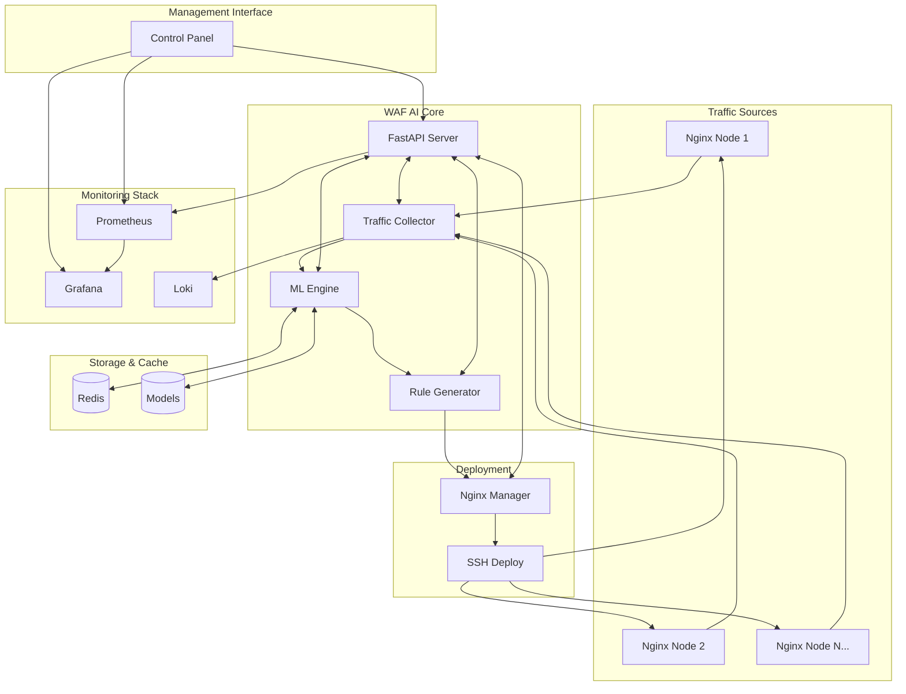

<div align="center">

# Nginx WAF AI

A machine learning system for nginx Web Application Firewall (WAF) rule generation and deployment.

[](https://www.python.org/downloads/)
[](https://fastapi.tiangolo.com/)
[](https://www.docker.com/)
[](LICENSE)

[Quick Start](#quick-start) • [API Documentation](#api-documentation) • [Architecture](#architecture) • [Installation](#installation) • [Testing](#testing)

</div>

---

## Overview

Nginx WAF AI analyzes HTTP traffic patterns, detects threats using machine learning, and generates protective WAF rules for nginx deployments. The system exposes a REST API, includes a web-based control panel, and ships with a CLI for common operations.

> **Note**: This project is early-stage. Several API endpoints are partial or incomplete. See [API.md](API.md) for the full implementation status.

### Features

- **Traffic Analysis** - Collects and parses HTTP request data from nginx nodes
- **ML-based Threat Detection** - Uses scikit-learn Isolation Forest (anomaly detection) and Random Forest (classification) models
- **WAF Rule Generation** - Converts ML predictions into nginx `deny`/`allow` rules
- **Multi-node Management** - Deploys rules to nginx nodes via SSH with configuration rollback on failure
- **REST API** - FastAPI server with JWT authentication and role-based access control
- **Control Panel** - Single-page HTML dashboard served via Docker
- **Monitoring** - Prometheus metrics endpoint; optional Grafana/Loki stack via Docker Compose

### Known Limitations

- `/auth/login` and `/auth/api-key` endpoints are currently commented out in the source; use the API directly with default credentials or create users via `/auth/users`
- Several endpoint stubs exist (see [API.md](API.md) for details)
- No WebSocket support
- No MLflow integration
- Rule rollback requires SSH access to nginx nodes

## Architecture


```mermaid
graph TB
    subgraph "Traffic Sources"
        N1[Nginx Node 1]
        N2[Nginx Node 2]
        N3[Nginx Node N...]
    end

    subgraph "WAF AI Core"
        TC[Traffic Collector]
        ML[ML Engine]
        RG[Rule Generator]
        API[FastAPI Server]
    end

    subgraph "Management Interface"
        CP[Control Panel]
    end

    subgraph "Storage & Cache"
        R[(Redis)]
        M[(Models)]
    end

    subgraph "Monitoring Stack"
        P[Prometheus]
        G[Grafana]
        L[Loki]
    end

    subgraph "Deployment"
        NM[Nginx Manager]
        SSH[SSH Deploy]
    end

    N1 --> TC
    N2 --> TC
    N3 --> TC

    TC --> ML
    ML --> RG
    RG --> NM
    NM --> SSH
    SSH --> N1
    SSH --> N2
    SSH --> N3

    API <--> TC
    API <--> ML
    API <--> RG
    API <--> NM

    CP --> API
    CP --> G
    CP --> P

    ML <--> R
    ML <--> M

    API --> P
    P --> G
    TC --> L
```

### Components

| Component | File | Description |
|-----------|------|-------------|
| Traffic Collector | `src/traffic_collector.py` | HTTP traffic ingestion and feature extraction |
| ML Engine | `src/ml_engine.py` | Threat detection using Isolation Forest and Random Forest |
| WAF Rule Generator | `src/waf_rule_generator.py` | Converts ML predictions into nginx rules |
| Nginx Manager | `src/nginx_manager.py` | SSH-based rule deployment to nginx nodes |
| API Server | `src/main.py` | FastAPI REST API with JWT auth and RBAC |
| Control Panel | `control-panel.html` / `docker/control-panel/` | Web interface for system management |

#### Traffic Collector (`src/traffic_collector.py`)

- Collects HTTP requests from nginx access logs or API endpoints
- Extracts security-relevant features: URL patterns, HTTP method, headers, payload size, time patterns, and suspicious pattern flags (SQL injection, XSS)
- Normalizes data for ML analysis

#### ML Engine (`src/ml_engine.py`)

- **Isolation Forest**: Unsupervised anomaly detection for unknown threats
- **Random Forest Classifier**: Supervised classification for known attack types (SQL injection, XSS, brute force)
- Provides confidence scoring and threat categorization
- Supports incremental retraining with new data

#### WAF Rule Generator (`src/waf_rule_generator.py`)

- Generates IP blocking and URL pattern rules in nginx configuration syntax
- Manages rule lifecycle including expiration and cleanup

#### Nginx Manager (`src/nginx_manager.py`)

- Deploys rules to nginx nodes via SSH
- Backs up existing configuration before deployment
- Rolls back configuration on deployment or reload failure

## Installation

### Prerequisites

- Python 3.8+
- Docker and Docker Compose (for full stack deployment)
- Redis (required for API server)
- nginx nodes with SSH access (for rule deployment)

### Option 1: Docker Compose (recommended)

```bash
git clone https://github.com/fabriziosalmi/nginx-waf-ai.git
cd nginx-waf-ai

docker-compose up -d

# Verify services
docker-compose ps
```

Services started:

| Service | Port |
|---------|------|
| WAF AI API | 8000 |
| Control Panel | 8090 |
| Redis | 6379 |
| Prometheus | 9090 |
| Grafana | 3080 |
| Loki | 3100 |
| Nginx test node 1 | 8081 |
| Nginx test node 2 | 8082 |

### Option 2: Local development

```bash
git clone https://github.com/fabriziosalmi/nginx-waf-ai.git
cd nginx-waf-ai

python -m venv .venv
source .venv/bin/activate  # On Windows: .venv\Scripts\activate

pip install -r requirements.txt

# Start Redis
redis-server

# Run the API server
python run_server.py
```

#### Environment variables

```bash
# API server
WAF_AI_HOST=0.0.0.0
WAF_AI_PORT=8000
WAF_AI_DEBUG=false

# Security
WAF_JWT_SECRET=your-256-bit-secret-key
WAF_ADMIN_PASSWORD=your-admin-password

# Redis
REDIS_URL=redis://localhost:6379

# ML model
WAF_AI_MODEL_PATH=models/waf_model.joblib
WAF_AI_THREAT_THRESHOLD=-0.5
WAF_AI_CONFIDENCE_THRESHOLD=0.8

# Nginx management
WAF_SSH_KEY_PATH=~/.ssh/nginx_key
WAF_NGINX_RELOAD_CMD=sudo systemctl reload nginx
```

See `.env.example` for a complete list of available settings.

#### Configuration files

Main configuration is in `config/waf_ai_config.json`. Example nginx node configuration in `config/nginx_nodes.json`:

```json
[
  {
    "node_id": "nginx-prod-1",
    "hostname": "web-server-1.example.com",
    "ssh_host": "10.0.1.10",
    "ssh_port": 22,
    "ssh_username": "nginx",
    "ssh_key_path": "~/.ssh/nginx_key",
    "nginx_config_path": "/etc/nginx/conf.d",
    "nginx_reload_command": "sudo systemctl reload nginx"
  }
]
```

## Quick Start

### Step 1: Start services

```bash
docker-compose up -d
curl http://localhost:8000/health
```

### Step 2: Train the ML model

```bash
# Using the API with sample data
curl -X POST "http://localhost:8000/api/training/start" \
  -H "Content-Type: application/json" \
  -H "Authorization: Bearer YOUR_TOKEN" \
  -d @data/sample_training_data.json

# Or using the CLI
python cli.py train \
  --training-data data/sample_training_data.json \
  --model-output models/waf_model.joblib
```

### Step 3: Add nginx nodes

```bash
curl -X POST "http://localhost:8000/api/nodes/add" \
  -H "Content-Type: application/json" \
  -H "Authorization: Bearer YOUR_TOKEN" \
  -d '{
    "node_id": "nginx-prod-1",
    "hostname": "web-server-1.example.com",
    "ssh_host": "10.0.1.10",
    "ssh_username": "nginx",
    "ssh_key_path": "~/.ssh/nginx_key",
    "nginx_config_path": "/etc/nginx/conf.d",
    "nginx_reload_command": "sudo systemctl reload nginx"
  }'
```

### Step 4: Start traffic collection and processing

```bash
# Start traffic collection
curl -X POST "http://localhost:8000/api/traffic/start-collection" \
  -H "Content-Type: application/json" \
  -H "Authorization: Bearer YOUR_TOKEN" \
  -d '["http://10.0.1.10:8080", "http://10.0.1.11:8080"]'

# Start real-time threat processing
curl -X POST "http://localhost:8000/api/processing/start" \
  -H "Authorization: Bearer YOUR_TOKEN"
```

### Step 5: Deploy WAF rules

```bash
# View detected threats
curl "http://localhost:8000/api/threats" \
  -H "Authorization: Bearer YOUR_TOKEN"

# Deploy generated rules to nodes
curl -X POST "http://localhost:8000/api/rules/deploy" \
  -H "Content-Type: application/json" \
  -H "Authorization: Bearer YOUR_TOKEN" \
  -d '{"node_ids": ["nginx-prod-1"], "force_deployment": false}'
```

### Access points

| Service | URL | Default credentials |
|---------|-----|---------------------|
| API documentation | http://localhost:8000/docs | - |
| Control Panel | http://localhost:8090 | - |
| Grafana | http://localhost:3080 | admin/waf-admin |
| Prometheus | http://localhost:9090 | - |

## CLI Usage

```bash
# Start the API server
python cli.py serve --host 0.0.0.0 --port 8000

# Train ML models
python cli.py train \
  --training-data data/requests.json \
  --labels data/labels.json \
  --model-output models/waf_model.joblib

# Start traffic collection
python cli.py collect \
  --nodes-config config/nginx_nodes.json \
  --model-path models/waf_model.joblib \
  --duration 3600

# Generate WAF rules from threat data
python cli.py generate-rules \
  --threats-file data/recent_threats.json \
  --output rules/new_rules.conf

# Deploy rules to nginx nodes
python cli.py deploy \
  --nodes-config config/nginx_nodes.json \
  --rules-file rules/waf_rules.conf

# Check node status
python cli.py status --nodes-config config/nginx_nodes.json

# Initialize configuration
python cli.py init-config --config-file config/waf_ai_config.json
```

## API Documentation

The API server provides interactive documentation at:

- Swagger UI: http://localhost:8000/docs
- ReDoc: http://localhost:8000/redoc

### Authentication

The API uses JWT bearer tokens with role-based access control:

```bash
# Login (requires the auth/login endpoint to be enabled - currently commented out in source)
curl -X POST "http://localhost:8000/auth/login" \
  -H "Content-Type: application/json" \
  -d '{"username": "admin", "password": "your_password"}'

# Use token in subsequent requests
curl -H "Authorization: Bearer YOUR_JWT_TOKEN" \
  "http://localhost:8000/api/status"
```

**Roles:**
- **Admin**: Full access including user management and node configuration
- **Operator**: Training, deployment, and rule management
- **Viewer**: Read-only access to status and monitoring data

### Implemented endpoints

| Method | Endpoint | Description | Role |
|--------|----------|-------------|------|
| `POST` | `/auth/users` | Create user | Admin |
| `GET` | `/auth/users` | List users | Admin |
| `GET` | `/api/security/stats` | Security statistics | Admin |
| `POST` | `/api/security/unblock-ip` | Unblock IP address | Admin |
| `POST` | `/api/security/emergency-shutdown` | Emergency shutdown | Admin |
| `GET` | `/` | Root | Public |
| `GET` | `/health` | Health check | Public |
| `GET` | `/metrics` | Prometheus metrics | Viewer |
| `GET` | `/api/debug/status` | Debug status | Operator |
| `GET` | `/api/status` | System status | Viewer |
| `GET` | `/api/health` | Detailed health | Viewer |
| `GET` | `/api/stats` | System statistics | Viewer |
| `POST` | `/api/nodes/add` | Add nginx node | Admin |
| `GET` | `/api/nodes` | List nodes | Viewer |
| `GET` | `/api/nodes/status` | Cluster status | Viewer |
| `POST` | `/api/training/start` | Start ML training | Operator |
| `POST` | `/api/traffic/start-collection` | Start traffic collection | Operator |
| `GET` | `/api/traffic/stats` | Traffic statistics | Viewer |
| `POST` | `/api/processing/start` | Start real-time processing | Operator |
| `POST` | `/api/processing/stop` | Stop real-time processing | Operator |
| `GET` | `/api/threats` | Recent threats | Viewer |
| `GET` | `/api/rules` | Active rules | Viewer |
| `POST` | `/api/rules/deploy` | Deploy rules | Admin |
| `GET` | `/api/config/nginx` | Nginx configuration | Operator |
| `GET` | `/api/rules/stats` | Rule statistics | Viewer |
| `POST` | `/api/rules/cleanup` | Clean up expired rules | Operator |

See [API.md](API.md) for full details on request/response formats and partial implementations.

## Security

### Configuration recommendations

- Set a strong `WAF_JWT_SECRET` (256-bit random key)
- Change the default admin password
- Use HTTPS in production (`WAF_USE_HTTPS=true` with valid certificates)
- Restrict access to management ports (8000, 8090) via firewall or VPN
- Use dedicated SSH keys with minimal permissions for nginx node access

### SSH key setup

```bash
ssh-keygen -t ed25519 -f ~/.ssh/nginx_waf_key -N ""
chmod 600 ~/.ssh/nginx_waf_key
```

## Monitoring

The system exposes Prometheus metrics at `/metrics`. When using the Docker Compose stack:

- **Grafana**: http://localhost:3080 (default credentials: admin/waf-admin)
- **Prometheus**: http://localhost:9090

Key metrics:
- `waf_threats_detected_total`
- `waf_requests_processed_total`
- `waf_rules_active`
- `waf_nodes_registered`

## Testing

```bash
# Install test dependencies
pip install -r test-requirements.txt

# Run unit tests
pytest tests/ -v

# Run with coverage
pytest tests/ --cov=src --cov-report=term-missing

# Run specific test file
pytest tests/test_ml_engine.py -v
```

## Contributing

See [CONTRIBUTING.md](CONTRIBUTING.md) for development guidelines, code style requirements, and the pull request process.

## License

This project is licensed under the MIT License - see the [LICENSE](LICENSE) file for details.

## Acknowledgments

- [scikit-learn](https://scikit-learn.org/) for ML algorithms
- [FastAPI](https://fastapi.tiangolo.com/) for the API framework
- [nginx](https://nginx.org/) for the web server platform
- [Prometheus](https://prometheus.io/) and [Grafana](https://grafana.com/) for monitoring
