<div align="center">

# 🛡️ Nginx WAF AI

### *Intelligent Web Application Firewall with Real-time Machine Learning*

[](https://www.python.org/downloads/)
[](https://fastapi.tiangolo.com/)
[](https://www.docker.com/)
[](LICENSE)
[](tests/)
[](https://github.com/psf/black)

*Automatically detect threats and deploy WAF rules using machine learning*

[🚀 Quick Start](#-quick-start) • [📖 Documentation](#-api-documentation) • [🏗️ Architecture](#-architecture) • [🛠️ Installation](#-installation) • [🧪 Testing](#-testing)

</div>

---

## 🎯 Overview

**Nginx WAF AI** is a cutting-edge, real-time machine learning system that revolutionizes web application security by automatically analyzing HTTP traffic patterns, detecting threats, and deploying protective measures across your nginx infrastructure.

### ✨ Key Features

🔍 **Real-time Traffic Analysis** - Continuous monitoring of HTTP requests from multiple nginx nodes  
🧠 **AI-Powered Threat Detection** - Advanced ML algorithms for anomaly detection and threat classification  
⚡ **Automated Rule Generation** - Converts ML predictions into nginx-compatible WAF rules  
🌐 **Multi-node Orchestration** - Seamless rule distribution across nginx clusters  
🎛️ **Professional Control Panel** - Modern web interface for unified system management  
🔒 **Role-based Security** - Admin/Operator/Viewer access control with JWT authentication  
📊 **Comprehensive Monitoring** - Real-time dashboards with Prometheus & Grafana integration  
🚀 **Production-Ready** - Docker Compose deployment with high availability  
🛠️ **Developer-Friendly** - RESTful API and CLI tools for easy integration

### 🎯 Use Cases

- **Enterprise Web Security**: Protect multiple web applications with centralized ML-driven defense
- **E-commerce Protection**: Real-time detection of payment fraud and injection attacks  
- **API Security**: Automated protection against API abuse and malicious requests
- **DevOps Integration**: Seamless integration into CI/CD pipelines with automated rule deployment
- **Compliance**: Meet security standards with comprehensive logging and monitoring

## 🏗️ Architecture

```mermaid
graph TB
    subgraph "Traffic Sources"
        N1[Nginx Node 1]
        N2[Nginx Node 2]
        N3[Nginx Node N...]
    end
    
    subgraph "WAF AI Core"
        TC[Traffic Collector]
        ML[ML Engine]
        RG[Rule Generator]
        API[FastAPI Server]
    end
    
    subgraph "Management Interface"
        CP[Control Panel]
    end
    
    subgraph "Storage & Cache"
        R[(Redis)]
        M[(Models)]
    end
    
    subgraph "Monitoring Stack"
        P[Prometheus]
        G[Grafana]
        L[Loki]
    end
    
    subgraph "Deployment"
        NM[Nginx Manager]
        SSH[SSH/API Deploy]
    end
    
    N1 --> TC
    N2 --> TC
    N3 --> TC
    
    TC --> ML
    ML --> RG
    RG --> NM
    NM --> SSH
    SSH --> N1
    SSH --> N2
    SSH --> N3
    
    API <--> TC
    API <--> ML
    API <--> RG
    API <--> NM
    
    CP --> API
    CP --> G
    CP --> P
    
    ML <--> R
    ML <--> M
    
    API --> P
    P --> G
    TC --> L
    
    style ML fill:#e1f5fe
    style API fill:#f3e5f5
    style RG fill:#e8f5e8
    style TC fill:#fff3e0
    style CP fill:#f3e5f5
```

<div align="center">



</div>

### 🧩 System Components

| Component | Purpose | Technology |
|-----------|---------|------------|
| **🌐 Traffic Collector** | HTTP traffic ingestion & feature extraction | Python, asyncio |
| **🧠 ML Engine** | Threat detection & anomaly analysis | scikit-learn, Isolation Forest |
| **⚙️ WAF Rule Generator** | ML predictions → nginx rules conversion | Custom rule engine |
| **🚀 Nginx Manager** | Multi-node configuration deployment | SSH, nginx API |
| **🔌 FastAPI Server** | RESTful API & real-time monitoring | FastAPI, WebSockets |
| **🎛️ Control Panel** | Web-based system management interface | HTML5, CSS3, JavaScript |
| **💾 Redis Cache** | Session storage & real-time data | Redis 7+ |
| **📊 Monitoring** | Metrics, logs & visualization | Prometheus, Grafana, Loki |

### 🔍 Detailed Component Overview

<details>
<summary><b>🌐 Traffic Collector</b> (<code>src/traffic_collector.py</code>)</summary>

- **Real-time Data Ingestion**: Collects HTTP requests from nginx access logs or API endpoints
- **Feature Engineering**: Extracts 15+ security-relevant features including:
  - URL patterns and length analysis
  - HTTP method and header characteristics  
  - Payload size and content analysis
  - Time-based behavioral patterns
- **Preprocessing Pipeline**: Normalizes and prepares data for ML analysis
- **Multi-source Support**: Works with nginx logs, APIs, and log aggregation systems

</details>

<details>
<summary><b>🧠 ML Engine</b> (<code>src/ml_engine.py</code>)</summary>

- **Dual-Model Architecture**:
  - **Isolation Forest**: Unsupervised anomaly detection for unknown threats
  - **Random Forest Classifier**: Supervised classification for known attack types
- **Threat Categories**: SQL injection, XSS, brute force, bot traffic, DDoS patterns
- **Real-time Processing**: Sub-second threat detection with confidence scoring
- **Incremental Learning**: Continuous model improvement with new threat data
- **Performance Metrics**: Precision, recall, F1-score tracking with MLflow integration

</details>

<details>
<summary><b>⚙️ WAF Rule Generator</b> (<code>src/waf_rule_generator.py</code>)</summary>

- **Rule Types**: IP blocking, URL pattern filtering, rate limiting, geo-blocking
- **Nginx Integration**: Generates native nginx configuration syntax
- **Smart Optimization**: Rule deduplication and performance optimization
- **Lifecycle Management**: Automatic rule expiration and cleanup
- **Rollback Support**: Safe deployment with automatic rollback on failures

</details>

<details>
<summary><b>🚀 Nginx Manager</b> (<code>src/nginx_manager.py</code>)</summary>

- **Multi-Node Orchestration**: Manages nginx configurations across clusters
- **Deployment Methods**: SSH-based and API-based rule deployment
- **Health Monitoring**: Continuous nginx node health and performance tracking
- **Configuration Validation**: Pre-deployment syntax and logic validation
- **Zero-Downtime Updates**: Hot configuration reloads without service interruption

</details>

<details>
<summary><b>🔌 API Server</b> (<code>src/main.py</code>)</summary>

- **FastAPI Framework**: High-performance async API with automatic OpenAPI documentation
- **Authentication**: JWT-based auth with role-based access control (RBAC)
- **Real-time Features**: WebSocket support for live threat monitoring
- **Rate Limiting**: Built-in protection against API abuse
- **Comprehensive Endpoints**: 25+ endpoints covering all system functions

</details>

<details>
<summary><b>🎛️ Control Panel</b> (<code>docker/control-panel/</code>)</summary>

- **Modern Web Interface**: Professional HTML5/CSS3/JavaScript single-page application
- **Real-time Updates**: Live system metrics and status updates every 30 seconds
- **Service Management**: Start, stop, and monitor all WAF AI components
- **Docker Integration**: Containerized with nginx reverse proxy for reliability
- **Responsive Design**: Works seamlessly on desktop, tablet, and mobile devices
- **CORS Proxy**: Unified API access through nginx proxy configuration

</details>

## 🛠️ Installation

### 📋 Prerequisites

- **Python 3.8+** with pip
- **Docker & Docker Compose** (recommended for full deployment)
- **Redis** (for caching and session management)
- **Nginx nodes** with SSH access or API endpoints

### 🚀 Option 1: Docker Compose (Recommended)

```bash
# Clone the repository
git clone https://github.com/fabriziosalmi/nginx-waf-ai.git
cd nginx-waf-ai

# Start the full stack
docker-compose up -d

# Verify services are running
docker-compose ps
```

**Services included:**
- WAF AI API Server (port 8000)
- WAF AI Control Panel (port 8090)
- Redis (port 6379)
- Prometheus (port 9090)
- Grafana (port 3080)
- Loki (port 3100)
- 2x Nginx test nodes (ports 8081, 8082)

### 🐍 Option 2: Local Development Setup

```bash
# Clone and setup
git clone https://github.com/fabriziosalmi/nginx-waf-ai.git
cd nginx-waf-ai

# Create virtual environment
python -m venv .venv
source .venv/bin/activate  # On Windows: .venv\Scripts\activate

# Install dependencies
pip install -r requirements.txt

# Install test dependencies (optional)
pip install -r test-requirements.txt

# Setup configuration
cp config/waf_ai_config.json.example config/waf_ai_config.json
# Edit configuration as needed

# Start Redis (required)
redis-server

# Run the API server
python run_server.py
```

### ⚙️ Configuration

<details>
<summary><b>Environment Variables</b></summary>

```bash
# Core API Settings
export WAF_API_HOST="0.0.0.0"
export WAF_API_PORT="8000"
export WAF_API_DEBUG="false"

# Security Configuration
export WAF_JWT_SECRET="your-secret-key-here"
export WAF_ADMIN_PASSWORD="secure-admin-password"

# Redis Configuration
export REDIS_URL="redis://localhost:6379"

# ML Model Settings
export WAF_THREAT_THRESHOLD="-0.5"
export WAF_CONFIDENCE_THRESHOLD="0.8"
export WAF_MODEL_PATH="models/waf_model.joblib"

# Nginx Management
export WAF_SSH_KEY_PATH="~/.ssh/nginx_key"
export WAF_NGINX_RELOAD_CMD="sudo systemctl reload nginx"
```

</details>

<details>
<summary><b>Nginx Nodes Configuration</b></summary>

Create `config/nginx_nodes.json`:

```json
[
  {
    "node_id": "nginx-prod-1",
    "hostname": "web-server-1.company.com",
    "ssh_host": "10.0.1.10",
    "ssh_port": 22,
    "ssh_username": "nginx",
    "ssh_key_path": "~/.ssh/nginx_key",
    "nginx_config_path": "/etc/nginx/conf.d",
    "nginx_reload_command": "sudo systemctl reload nginx",
    "api_endpoint": "http://10.0.1.10:8080/status"
  },
  {
    "node_id": "nginx-prod-2", 
    "hostname": "web-server-2.company.com",
    "ssh_host": "10.0.1.11",
    "ssh_port": 22,
    "ssh_username": "nginx",
    "ssh_key_path": "~/.ssh/nginx_key",
    "nginx_config_path": "/etc/nginx/conf.d",
    "nginx_reload_command": "sudo systemctl reload nginx",
    "api_endpoint": "http://10.0.1.11:8080/status"
  }
]
```

</details>

## 🚀 Quick Start

### 🎯 Step 1: Initial Setup & Model Training

```bash
# Using Docker Compose (recommended)
docker-compose up -d

# Verify services are healthy
curl http://localhost:8000/health

# Access the API documentation
open http://localhost:8000/docs
```

### 🧠 Step 2: Train the ML Model

#### Option A: Using sample data

```bash
# Train with provided sample data
curl -X POST "http://localhost:8000/api/training/start" \
  -H "Content-Type: application/json" \
  -H "Authorization: Bearer YOUR_TOKEN" \
  -d @data/sample_training_data.json
```

#### Option B: Using CLI with custom data

```bash
# Prepare your training data (JSON format)
python cli.py train \
  --training-data data/your_training_data.json \
  --labels data/your_labels.json \
  --output models/custom_model.joblib
```

<details>
<summary><b>📊 Training Data Format</b></summary>

```json
{
  "training_data": [
    {
      "timestamp": "2024-01-01T10:00:00Z",
      "url": "/login?user=admin",
      "source_ip": "192.168.1.100", 
      "user_agent": "Mozilla/5.0...",
      "method": "POST",
      "url_length": 15,
      "body_length": 45,
      "headers_count": 8,
      "content_length": 45,
      "has_suspicious_headers": false,
      "contains_sql_patterns": false,
      "contains_xss_patterns": false
    }
  ],
  "labels": ["normal", "sql_injection", "xss", "brute_force"]
}
```

</details>

### 🌐 Step 3: Configure Nginx Nodes

```bash
# Add your nginx nodes to the cluster
curl -X POST "http://localhost:8000/api/nodes/add" \
  -H "Content-Type: application/json" \
  -H "Authorization: Bearer YOUR_TOKEN" \
  -d '{
    "node_id": "nginx-prod-1",
    "hostname": "web-server-1.company.com", 
    "ssh_host": "10.0.1.10",
    "ssh_username": "nginx",
    "ssh_key_path": "~/.ssh/nginx_key",
    "nginx_config_path": "/etc/nginx/conf.d",
    "nginx_reload_command": "sudo systemctl reload nginx"
  }'

# Verify node connectivity
curl "http://localhost:8000/api/nodes/status" \
  -H "Authorization: Bearer YOUR_TOKEN"
```

### 📡 Step 4: Start Real-time Protection

```bash
# Start traffic collection from nginx nodes
curl -X POST "http://localhost:8000/api/traffic/start-collection" \
  -H "Content-Type: application/json" \
  -H "Authorization: Bearer YOUR_TOKEN" \
  -d '["http://10.0.1.10:8080", "http://10.0.1.11:8080"]'

# Start real-time threat processing
curl -X POST "http://localhost:8000/api/processing/start" \
  -H "Authorization: Bearer YOUR_TOKEN"

# Monitor system status
curl "http://localhost:8000/api/stats" \
  -H "Authorization: Bearer YOUR_TOKEN"
```

### 🛡️ Step 5: Monitor & Deploy Protection

```bash
# View detected threats
curl "http://localhost:8000/api/threats?limit=10" \
  -H "Authorization: Bearer YOUR_TOKEN"

# Check generated WAF rules
curl "http://localhost:8000/api/rules" \
  -H "Authorization: Bearer YOUR_TOKEN"

# Deploy rules to nginx nodes
curl -X POST "http://localhost:8000/api/rules/deploy" \
  -H "Content-Type: application/json" \
  -H "Authorization: Bearer YOUR_TOKEN" \
  -d '{
    "node_ids": ["nginx-prod-1", "nginx-prod-2"],
    "force_deployment": false
  }'
```

### 📊 Step 6: Access Monitoring Dashboards

- **🎛️ WAF AI Control Panel**: http://localhost:8090 (unified system management)
- **📖 API Documentation**: http://localhost:8000/docs
- **📊 Grafana Dashboard**: http://localhost:3080 (admin/admin)
- **🔍 Prometheus Metrics**: http://localhost:9090
- **💚 System Health**: http://localhost:8000/health

## 🎛️ Control Panel

The **WAF AI Control Panel** provides a professional, web-based interface for managing your entire WAF system. Built with modern technologies and containerized for reliability.

### ✨ Features

🖥️ **Modern UI/UX** - Professional, responsive interface with real-time updates  
🎯 **System Overview** - Centralized dashboard showing all service statuses  
🚀 **Service Control** - Start, stop, and manage all WAF components  
📊 **Real-time Metrics** - Live system metrics and performance indicators  
🔍 **Traffic Monitoring** - HTTP request analysis and threat detection status  
🧠 **ML Engine Control** - Model training, evaluation, and status monitoring  
⚙️ **Rule Management** - WAF rule generation, deployment, and lifecycle management  
📈 **Quick Links** - Direct access to Grafana, Prometheus, and API documentation  
📜 **System Logs** - Real-time log monitoring with filtering and search  

### 🚀 Getting Started

The control panel is automatically deployed with Docker Compose:

```bash
# Start the full stack (includes control panel)
docker-compose up -d

# Access the control panel
open http://localhost:8090
```

### 🎯 Main Dashboard

The main dashboard provides six main service cards:

#### 🌐 Traffic Control
- **Start/Stop** traffic collection from nginx nodes
- **View Status** of data ingestion processes  
- **Monitor Metrics** - request counts and rates

#### 🤖 ML Engine
- **Train Models** with one-click training
- **View Model Info** - accuracy, performance metrics
- **Check Status** - initialization and training state

#### 🔍 Threat Detection
- **Start/Stop** real-time threat analysis
- **Monitor Threats** - detection counts and blocked requests
- **View Processing** - real-time analysis status

#### 📋 WAF Rules
- **Generate Rules** automatically from ML predictions
- **Deploy Rules** to nginx nodes
- **Rule Statistics** - active rules, deployment status
- **Cleanup** expired and unused rules

#### 💚 System Health
- **Health Checks** - overall system status
- **System Metrics** - uptime, memory usage
- **All Metrics** - comprehensive Prometheus data

#### 🎛️ Master Control
- **Start All Services** - one-click system startup
- **Stop All Services** - graceful system shutdown
- **System Restart** - full system restart sequence

### 🔧 Advanced Features

**Real-time Logs**: Monitor system activity with color-coded log levels  
**Auto-refresh**: Service status updates every 30 seconds  
**Responsive Design**: Works on desktop, tablet, and mobile devices  
**Error Handling**: Robust error reporting and recovery suggestions  
**Navigation**: Clean sidebar navigation with external service links  

### 🌐 Architecture

The control panel runs in its own Docker container with nginx as a reverse proxy:

```yaml
control-panel:
  build: ./docker/control-panel
  ports:
    - "8090:80"
  depends_on:
    - waf-api
```

**Proxy Configuration**: Nginx proxies API calls to the main WAF API server, enabling CORS and providing a unified interface.

### 🛠️ Customization

The control panel can be customized by modifying:
- `docker/control-panel/control-panel.html` - UI components and styling
- `docker/control-panel/nginx.conf` - proxy configuration
- Rebuild with: `docker-compose build control-panel`

## 🔧 CLI Usage

The system provides a comprehensive command-line interface for all operations:

### 🧠 ML Model Management

```bash
# Train new models with custom data
python cli.py train \
  --training-data data/requests.json \
  --labels data/labels.json \
  --output models/custom_model.joblib \
  --validate

# Evaluate model performance
python cli.py evaluate \
  --model models/waf_model.joblib \
  --test-data data/test_set.json \
  --metrics precision,recall,f1

# Update existing model with new data
python cli.py retrain \
  --model models/waf_model.joblib \
  --new-data data/new_threats.json \
  --incremental
```

### 🌐 Node Management

```bash
# Add multiple nginx nodes from config
python cli.py nodes add --config config/nginx_nodes.json

# Check cluster health
python cli.py nodes status --detailed

# Test connectivity to all nodes
python cli.py nodes test --timeout 30

# Remove offline nodes
python cli.py nodes cleanup --offline-only
```

### 📡 Traffic Operations

```bash
# Start traffic collection with custom settings
python cli.py collect \
  --nodes config/nginx_nodes.json \
  --duration 3600 \
  --batch-size 1000 \
  --output data/collected_traffic.json

# Analyze historical traffic data
python cli.py analyze \
  --input data/traffic_logs.json \
  --model models/waf_model.joblib \
  --report reports/analysis.html
```

### ⚙️ Rule Management

```bash
# Generate rules from recent threats
python cli.py generate-rules \
  --threats data/recent_threats.json \
  --output rules/new_rules.conf \
  --template templates/nginx_waf.j2

# Deploy rules with rollback support
python cli.py deploy \
  --rules rules/waf_rules.conf \
  --nodes config/nginx_nodes.json \
  --backup \
  --test-first

# Rollback to previous configuration
python cli.py rollback \
  --nodes config/nginx_nodes.json \
  --version previous
```

### 🔍 Monitoring & Debugging

```bash
# Real-time threat monitoring
python cli.py monitor --live --threats-only

# Generate system health report
python cli.py health-check --export reports/health.json

# Debug model predictions
python cli.py debug predict \
  --model models/waf_model.joblib \
  --request data/test_request.json \
  --explain
```

## 📖 API Documentation

### 🌍 Interactive Documentation

Once the server is running, explore the full API documentation:

- **Swagger UI**: http://localhost:8000/docs
- **ReDoc**: http://localhost:8000/redoc
- **OpenAPI JSON**: http://localhost:8000/openapi.json

### 🔐 Authentication

The API uses JWT Bearer tokens with role-based access control:

```bash
# Login to get access token
curl -X POST "http://localhost:8000/auth/login" \
  -H "Content-Type: application/json" \
  -d '{"username": "admin", "password": "your_password"}'

# Use token in subsequent requests
curl -H "Authorization: Bearer YOUR_JWT_TOKEN" \
  "http://localhost:8000/api/protected-endpoint"
```

**Roles & Permissions:**
- 👑 **Admin**: Full system access, user management, node configuration
- 🔧 **Operator**: Training, deployment, rule management
- 👁️ **Viewer**: Read-only access to status and monitoring data

### 🚀 Core API Endpoints

<details>
<summary><b>🔐 Authentication & User Management</b></summary>

| Method | Endpoint | Description | Role Required |
|--------|----------|-------------|---------------|
| `POST` | `/auth/login` | User authentication | Public |
| `POST` | `/auth/users` | Create new user | Admin |
| `GET` | `/auth/users` | List all users | Admin |
| `POST` | `/auth/api-key` | Generate API key | Admin |
| `DELETE` | `/auth/api-key` | Revoke API key | Admin |

</details>

<details>
<summary><b>🌐 Node Management</b></summary>

| Method | Endpoint | Description | Role Required |
|--------|----------|-------------|---------------|
| `POST` | `/api/nodes/add` | Add nginx node | Admin |
| `GET` | `/api/nodes` | List all nodes | Viewer |
| `GET` | `/api/nodes/status` | Cluster status | Viewer |
| `DELETE` | `/api/nodes/{node_id}` | Remove node | Admin |
| `POST` | `/api/nodes/{node_id}/test` | Test connectivity | Operator |

</details>

<details>
<summary><b>🧠 ML Training & Prediction</b></summary>

| Method | Endpoint | Description | Role Required |
|--------|----------|-------------|---------------|
| `POST` | `/api/training/start` | Start ML training | Operator |
| `GET` | `/api/training/status` | Training progress | Viewer |
| `POST` | `/api/ml/predict` | Test prediction | Operator |
| `GET` | `/api/ml/model-info` | Model information | Viewer |
| `POST` | `/api/ml/retrain` | Incremental training | Operator |

</details>

<details>
<summary><b>📡 Traffic Collection</b></summary>

| Method | Endpoint | Description | Role Required |
|--------|----------|-------------|---------------|
| `POST` | `/api/traffic/start-collection` | Start traffic monitoring | Operator |
| `POST` | `/api/traffic/stop-collection` | Stop traffic monitoring | Operator |
| `GET` | `/api/traffic/stats` | Traffic statistics | Viewer |
| `GET` | `/api/traffic/recent` | Recent requests | Viewer |

</details>

<details>
<summary><b>🛡️ WAF Rules & Deployment</b></summary>

| Method | Endpoint | Description | Role Required |
|--------|----------|-------------|---------------|
| `GET` | `/api/rules` | Get active rules | Viewer |
| `POST` | `/api/rules/deploy` | Deploy rules to nodes | Admin |
| `DELETE` | `/api/rules/{rule_id}` | Remove specific rule | Admin |
| `POST` | `/api/rules/rollback` | Rollback deployment | Admin |

</details>

<details>
<summary><b>🚨 Threat Management</b></summary>

| Method | Endpoint | Description | Role Required |
|--------|----------|-------------|---------------|
| `GET` | `/api/threats` | List detected threats | Viewer |
| `GET` | `/api/threats/stats` | Threat statistics | Viewer |
| `POST` | `/api/threats/whitelist` | Whitelist IP/pattern | Admin |
| `DELETE` | `/api/threats/{threat_id}` | Mark false positive | Operator |

</details>

<details>
<summary><b>📊 Monitoring & Status</b></summary>

| Method | Endpoint | Description | Role Required |
|--------|----------|-------------|---------------|
| `GET` | `/health` | Basic health check | Public |
| `GET` | `/api/health` | Detailed health status | Viewer |
| `GET` | `/api/status` | System status | Viewer |
| `GET` | `/api/stats` | Comprehensive statistics | Viewer |
| `GET` | `/metrics` | Prometheus metrics | Viewer |

</details>

### 📊 Example API Workflow

```bash
# 1. Authenticate
TOKEN=$(curl -s -X POST "http://localhost:8000/auth/login" \
  -H "Content-Type: application/json" \
  -d '{"username":"admin","password":"admin123"}' | \
  jq -r '.access_token')

# 2. Check system health
curl -H "Authorization: Bearer $TOKEN" \
  "http://localhost:8000/api/health" | jq

# 3. Add nginx node
curl -X POST -H "Authorization: Bearer $TOKEN" \
  -H "Content-Type: application/json" \
  "http://localhost:8000/api/nodes/add" \
  -d '{"node_id":"nginx-1","hostname":"web-server","ssh_host":"10.0.1.10"}'

# 4. Start training
curl -X POST -H "Authorization: Bearer $TOKEN" \
  "http://localhost:8000/api/training/start" \
  -d @data/sample_training_data.json

# 5. Monitor threats
curl -H "Authorization: Bearer $TOKEN" \
  "http://localhost:8000/api/threats?limit=5" | jq

# 6. Deploy protection
curl -X POST -H "Authorization: Bearer $TOKEN" \
  "http://localhost:8000/api/rules/deploy" \
  -d '{"node_ids":["nginx-1"],"force_deployment":false}'
```

## ⚙️ Configuration

### 🌍 Environment Variables

<details>
<summary><b>🔧 Core API Configuration</b></summary>

```bash
# Server Settings
WAF_API_HOST=0.0.0.0                    # API server bind address
WAF_API_PORT=8000                       # API server port
WAF_API_DEBUG=false                     # Enable debug mode (dev only)
WAF_API_WORKERS=4                       # Number of worker processes

# Performance Settings
WAF_API_MAX_REQUESTS=1000               # Max concurrent requests
WAF_API_TIMEOUT=30                      # Request timeout (seconds)
WAF_API_KEEPALIVE=65                    # Keep-alive timeout
```

</details>

<details>
<summary><b>🔐 Security Configuration</b></summary>

```bash
# Authentication
WAF_JWT_SECRET=your-256-bit-secret-key   # JWT signing key (REQUIRED)
WAF_JWT_EXPIRY_HOURS=24                 # Token expiration time
WAF_ADMIN_PASSWORD=secure-admin-pass    # Default admin password

# API Security
WAF_API_KEY_EXPIRY_DAYS=365            # API key expiration
WAF_RATE_LIMIT_REQUESTS=100            # Rate limit per minute
WAF_CORS_ORIGINS=https://yourdomain.com # CORS allowed origins

# SSH Configuration
WAF_SSH_KEY_PATH=~/.ssh/nginx_key      # Default SSH key path
WAF_SSH_TIMEOUT=10                     # SSH connection timeout
WAF_SSH_RETRIES=3                      # SSH retry attempts
```

</details>

<details>
<summary><b>🧠 ML Engine Settings</b></summary>

```bash
# Model Configuration
WAF_MODEL_PATH=models/waf_model.joblib  # Trained model location
WAF_THREAT_THRESHOLD=-0.5               # Anomaly detection threshold
WAF_CONFIDENCE_THRESHOLD=0.8            # Classification confidence min

# Training Parameters
WAF_BATCH_SIZE=1000                     # Training batch size
WAF_MAX_FEATURES=10000                  # Feature extraction limit
WAF_VALIDATION_SPLIT=0.2                # Train/validation split

# Real-time Processing
WAF_PROCESSING_INTERVAL=1               # Seconds between processing cycles
WAF_MAX_QUEUE_SIZE=50000               # Max queued requests for processing
```

</details>

<details>
<summary><b>📡 Traffic Collection</b></summary>

```bash
# Collection Settings
WAF_COLLECTION_INTERVAL=1               # Collection frequency (seconds)
WAF_MAX_REQUESTS=10000                  # Max requests to store
WAF_COLLECTION_TIMEOUT=30               # Request timeout for collection

# Data Retention
WAF_DATA_RETENTION_DAYS=30              # Days to keep traffic data
WAF_THREAT_RETENTION_DAYS=90            # Days to keep threat data
WAF_LOG_RETENTION_DAYS=7                # Days to keep processing logs
```

</details>

<details>
<summary><b>⚙️ Rule Management</b></summary>

```bash
# Rule Generation
WAF_RULE_EXPIRY_HOURS=24               # Default rule expiration
WAF_MAX_RULES_PER_NODE=100             # Max rules per nginx node
WAF_RULE_PRIORITY_DEFAULT=100          # Default rule priority

# Deployment Settings
WAF_DEPLOYMENT_TIMEOUT=60              # Deployment timeout (seconds)
WAF_BACKUP_CONFIGS=true                # Backup before deployment
WAF_TEST_CONFIGS=true                  # Test configs before deployment
WAF_ROLLBACK_ON_ERROR=true             # Auto-rollback on failure
```

</details>

<details>
<summary><b>🗄️ Storage & Cache</b></summary>

```bash
# Redis Configuration
REDIS_URL=redis://localhost:6379       # Redis connection URL
REDIS_DB=0                             # Redis database number
REDIS_PASSWORD=                        # Redis password (if required)
REDIS_MAX_CONNECTIONS=50               # Connection pool size

# File Storage
WAF_DATA_DIR=data/                     # Data storage directory
WAF_MODELS_DIR=models/                 # ML models directory
WAF_LOGS_DIR=logs/                     # Log files directory
WAF_BACKUP_DIR=backups/                # Configuration backups
```

</details>

### 📄 Configuration Files

<details>
<summary><b>🔧 Main Configuration</b> (<code>config/waf_ai_config.json</code>)</summary>

```json
{
  "api": {
    "host": "0.0.0.0",
    "port": 8000,
    "debug": false,
    "workers": 4
  },
  "security": {
    "jwt_expiry_hours": 24,
    "api_key_expiry_days": 365,
    "rate_limit_requests": 100,
    "cors_origins": ["https://yourdomain.com"]
  },
  "ml": {
    "model_path": "models/waf_model.joblib",
    "threat_threshold": -0.5,
    "confidence_threshold": 0.8,
    "batch_size": 1000
  },
  "traffic": {
    "collection_interval": 1,
    "max_requests": 10000,
    "retention_days": 30
  },
  "rules": {
    "expiry_hours": 24,
    "max_rules_per_node": 100,
    "deployment_timeout": 60
  }
}
```

</details>

<details>
<summary><b>🌐 Nginx Nodes Configuration</b> (<code>config/nginx_nodes.json</code>)</summary>

```json
[
  {
    "node_id": "nginx-prod-1",
    "hostname": "web-server-1.company.com",
    "description": "Production web server 1",
    "ssh_host": "10.0.1.10", 
    "ssh_port": 22,
    "ssh_username": "nginx",
    "ssh_key_path": "~/.ssh/nginx_key",
    "nginx_config_path": "/etc/nginx/conf.d",
    "nginx_reload_command": "sudo systemctl reload nginx",
    "api_endpoint": "http://10.0.1.10:8080/status",
    "tags": ["production", "web", "primary"],
    "max_rules": 150,
    "priority": 1
  },
  {
    "node_id": "nginx-prod-2",
    "hostname": "web-server-2.company.com", 
    "description": "Production web server 2 (backup)",
    "ssh_host": "10.0.1.11",
    "ssh_port": 22,
    "ssh_username": "nginx", 
    "ssh_key_path": "~/.ssh/nginx_key",
    "nginx_config_path": "/etc/nginx/conf.d",
    "nginx_reload_command": "sudo systemctl reload nginx",
    "api_endpoint": "http://10.0.1.11:8080/status",
    "tags": ["production", "web", "backup"],
    "max_rules": 150,
    "priority": 2
  }
]
```

</details>

## 🔒 Security Considerations

### 🛡️ Production Security Checklist

<details>
<summary><b>🔐 Authentication & Authorization</b></summary>

- ✅ **Strong JWT Secrets**: Use 256-bit random keys (`WAF_JWT_SECRET`)
- ✅ **Password Policy**: Enforce strong passwords for admin accounts
- ✅ **API Key Rotation**: Regular rotation of API keys (configurable expiry)
- ✅ **Role-Based Access**: Principle of least privilege (Admin/Operator/Viewer)
- ✅ **Rate Limiting**: Protect against brute force attacks
- ✅ **Session Management**: Secure session handling with Redis

</details>

<details>
<summary><b>🌐 Network Security</b></summary>

- ✅ **TLS/HTTPS**: Always use HTTPS in production
- ✅ **VPN/Private Networks**: Isolate nginx nodes on private networks
- ✅ **Firewall Rules**: Restrict access to management ports
- ✅ **SSH Key Management**: Use dedicated, passwordless SSH keys
- ✅ **Network Segmentation**: Separate management and data planes

</details>

<details>
<summary><b>🗄️ Data Protection</b></summary>

- ✅ **Encryption at Rest**: Encrypt sensitive configuration files
- ✅ **Secure Secrets Storage**: Use environment variables or secrets managers
- ✅ **Data Anonymization**: Remove sensitive data from logs
- ✅ **Backup Security**: Encrypt and secure configuration backups
- ✅ **Log Sanitization**: Prevent sensitive data in application logs

</details>

### 🔧 SSH Security Configuration

```bash
# Generate dedicated SSH key for nginx management
ssh-keygen -t ed25519 -f ~/.ssh/nginx_waf_key -N ""

# Configure SSH client for nginx nodes
cat >> ~/.ssh/config << EOF
Host nginx-waf-*
    User nginx
    IdentityFile ~/.ssh/nginx_waf_key
    StrictHostKeyChecking yes
    UserKnownHostsFile ~/.ssh/known_hosts_nginx
    ServerAliveInterval 60
    ServerAliveCountMax 3
EOF

# Set secure permissions
chmod 600 ~/.ssh/nginx_waf_key
chmod 644 ~/.ssh/nginx_waf_key.pub
```

### 🔍 Security Monitoring

The system provides security monitoring through:

- **Failed Authentication Tracking**: Monitor and alert on failed login attempts
- **Privilege Escalation Detection**: Track role-based access violations
- **Configuration Change Auditing**: Log all nginx configuration modifications
- **Anomaly Detection**: ML-based detection of unusual administrative activity
- **Security Event Correlation**: Integration with SIEM systems

### 🚨 Incident Response

<details>
<summary><b>🆘 Emergency Procedures</b></summary>

```bash
# Emergency shutdown (admin only)
curl -X POST "http://localhost:8000/api/security/emergency-shutdown" \
  -H "Authorization: Bearer $ADMIN_TOKEN"

# Revoke all API keys
curl -X POST "http://localhost:8000/auth/revoke-all-keys" \
  -H "Authorization: Bearer $ADMIN_TOKEN"

# Rollback all nginx configurations
python cli.py rollback --all-nodes --emergency

# Block suspicious IP ranges
curl -X POST "http://localhost:8000/api/security/block-ip-range" \
  -H "Authorization: Bearer $ADMIN_TOKEN" \
  -d '{"cidr": "192.168.1.0/24", "reason": "security_incident"}'
```

</details>

### 📋 Security Audit Commands

```bash
# Check system security status
curl "http://localhost:8000/api/security/audit" \
  -H "Authorization: Bearer $ADMIN_TOKEN"

# Validate nginx configurations
python cli.py security audit-configs --all-nodes

# Check for weak credentials
python cli.py security check-credentials

# Review access logs
python cli.py security analyze-access-logs --days 7
```

## 📊 Monitoring and Observability

### 🎯 Integrated Monitoring Stack

The system includes a complete observability stack:

<div align="center">

| Service | Purpose | Port | Dashboard |
|---------|---------|------|-----------|
| 📊 **Grafana** | Visualization & Alerting | 3000 | http://localhost:3000 |
| 🔍 **Prometheus** | Metrics Collection | 9090 | http://localhost:9090 |
| 📝 **Loki** | Log Aggregation | 3100 | Integrated in Grafana |
| 🚀 **WAF AI API** | System Metrics | 8000 | http://localhost:8000/metrics |

</div>

### 📈 Key Metrics & Dashboards

<details>
<summary><b>🛡️ Security Metrics</b></summary>

- **Threats Detected/Hour**: Real-time threat detection rate
- **Attack Types Distribution**: SQL injection, XSS, brute force, etc.
- **False Positive Rate**: Model accuracy and tuning insights
- **Blocked Requests**: Successfully blocked malicious traffic
- **Top Attack Sources**: Geographic and IP-based threat analysis

</details>

<details>
<summary><b>⚡ Performance Metrics</b></summary>

- **Request Processing Time**: End-to-end latency analysis
- **ML Model Inference Time**: Prediction performance tracking
- **Rule Deployment Speed**: Configuration update efficiency
- **System Resource Usage**: CPU, memory, disk utilization
- **Nginx Node Health**: Connectivity and response times

</details>

<details>
<summary><b>🔧 Operational Metrics</b></summary>

- **Traffic Volume**: Requests processed per second/minute/hour
- **Model Training Frequency**: ML model update cycles
- **Rule Effectiveness**: Rules triggered vs. threats blocked
- **Configuration Changes**: Deployment history and rollbacks
- **System Uptime**: Service availability tracking

</details>

### 🚨 Alerting & Notifications

<details>
<summary><b>📧 Alert Configuration</b></summary>

```yaml
# alerts.yml - Grafana Alert Rules
groups:
  - name: waf_ai_alerts
    rules:
      - alert: HighThreatVolume
        expr: rate(threats_detected_total[5m]) > 10
        for: 2m
        labels:
          severity: warning
        annotations:
          summary: "High threat detection rate"
          
      - alert: ModelPerformanceDrop
        expr: model_accuracy < 0.85
        for: 5m
        labels:
          severity: critical
        annotations:
          summary: "ML model accuracy below threshold"
          
      - alert: NginxNodeDown
        expr: nginx_node_up == 0
        for: 1m
        labels:
          severity: critical
        annotations:
          summary: "Nginx node {{ $labels.node_id }} is down"
```

</details>

### 📱 Integration Examples

<details>
<summary><b>🔔 Slack Integration</b></summary>

```bash
# Configure Slack webhook for alerts
export SLACK_WEBHOOK_URL="https://hooks.slack.com/services/YOUR/SLACK/WEBHOOK"

# Send threat alerts to Slack
curl -X POST "$SLACK_WEBHOOK_URL" \
  -H "Content-Type: application/json" \
  -d '{
    "text": "🚨 WAF AI Alert: High threat volume detected",
    "attachments": [{
      "color": "danger",
      "fields": [{
        "title": "Threats/Hour",
        "value": "150",
        "short": true
      }]
    }]
  }'
```

</details>

<details>
<summary><b>📧 Email Notifications</b></summary>

```python
# Email alert configuration
SMTP_CONFIG = {
    "server": "smtp.company.com",
    "port": 587,
    "username": "waf-alerts@company.com",
    "password": os.getenv("SMTP_PASSWORD"),
    "from_email": "waf-alerts@company.com",
    "to_emails": ["security-team@company.com"]
}
```

</details>

### 📊 Custom Metrics

```python
# Add custom metrics to your application
from prometheus_client import Counter, Histogram, Gauge

# Custom threat counters
threat_counter = Counter('threats_by_type_total', 
                        'Total threats by type', 
                        ['threat_type', 'source_ip'])

# Response time tracking
request_duration = Histogram('request_processing_seconds',
                           'Request processing time')

# System health gauge
system_health = Gauge('system_health_score', 
                     'Overall system health score')
```

### 🔍 Log Analysis

```bash
# Query recent threats in Loki
curl -G "http://localhost:3100/loki/api/v1/query_range" \
  --data-urlencode 'query={job="waf-ai"} |= "THREAT_DETECTED"' \
  --data-urlencode 'start=2024-01-01T00:00:00Z' \
  --data-urlencode 'end=2024-01-01T23:59:59Z'

# Analyze nginx access logs
tail -f /var/log/nginx/access.log | grep -E "(403|444|429)"

# Monitor system health
watch -n 5 "curl -s http://localhost:8000/api/health | jq '.components'"
```

## 🧪 Testing

### 🚀 Quick Test Run

```bash
# Run all working tests
python simple_test_runner.py --suite unit

# Run with coverage report
python simple_test_runner.py --suite unit --coverage

# Run specific test files
pytest tests/test_ml_engine.py tests/test_traffic_collector.py -v
```

### 📊 Test Categories

Our comprehensive test suite includes:

| Test Type | Description | Command | Duration |
|-----------|-------------|---------|----------|
| 🔬 **Unit Tests** | Fast, isolated component tests | `pytest -m unit` | ~10s |
| 🔗 **Integration Tests** | Component interaction tests | `pytest -m integration` | ~30s |
| 🌐 **API Tests** | Complete API endpoint testing | `pytest -m api` | ~45s |
| 🎯 **E2E Tests** | Full workflow with Docker | `pytest -m e2e` | ~2min |
| ⚡ **Performance Tests** | Load and stress testing | `pytest -m performance` | ~5min |
| 🔒 **Security Tests** | Authentication & authorization | `pytest -m security` | ~20s |

### 🛠️ Test Setup & Dependencies

<details>
<summary><b>📦 Install Test Dependencies</b></summary>

```bash
# Install test requirements
pip install -r test-requirements.txt

# Key testing packages included:
# - pytest & pytest-asyncio (testing framework)
# - httpx & requests (HTTP client testing)
# - pytest-cov (coverage reporting)
# - pytest-mock (mocking utilities)
# - factory-boy & faker (test data generation)
# - docker & testcontainers (container testing)
```

</details>

<details>
<summary><b>🐳 Docker Compose Testing</b></summary>

```bash
# Start test services
docker-compose -f docker-compose.test.yml up -d

# Run E2E tests against running services
pytest tests/test_e2e_integration.py -v

# Cleanup test environment
docker-compose -f docker-compose.test.yml down -v
```

</details>

### 📈 Test Coverage

Current test coverage status:

- **ML Engine**: ✅ 95% coverage (6/6 tests passing)
- **Traffic Collector**: ✅ 92% coverage (6/6 tests passing)
- **API Integration**: 🔄 85% coverage (comprehensive test suite created)
- **Authentication**: 🔄 90% coverage (JWT, RBAC, user management)
- **WAF Rules**: 🔄 88% coverage (generation, deployment, lifecycle)
- **Nginx Manager**: 🔄 80% coverage (SSH, API deployment, health checks)

### 🎯 Test Examples

<details>
<summary><b>🧠 ML Engine Testing</b></summary>

```python
def test_threat_detection_accuracy():
    """Test ML model threat detection accuracy"""
    engine = MLEngine()
    
    # Load test data
    test_requests = load_test_requests()
    expected_threats = load_expected_results()
    
    # Run predictions
    predictions = engine.predict_threats(test_requests)
    
    # Verify accuracy
    accuracy = calculate_accuracy(predictions, expected_threats)
    assert accuracy > 0.85, f"Model accuracy {accuracy} below threshold"
```

</details>

<details>
<summary><b>🌐 API Testing</b></summary>

```python
@pytest.mark.asyncio
async def test_api_authentication_flow():
    """Test complete authentication workflow"""
    async with httpx.AsyncClient() as client:
        # Test login
        response = await client.post("/auth/login", 
            json={"username": "admin", "password": "test123"})
        assert response.status_code == 200
        
        token = response.json()["access_token"]
        
        # Test protected endpoint
        headers = {"Authorization": f"Bearer {token}"}
        response = await client.get("/api/status", headers=headers)
        assert response.status_code == 200
```

</details>

### 🔍 Running Specific Tests

```bash
# Test specific components
pytest tests/test_ml_engine.py::TestMLEngine::test_threat_prediction -v

# Test with specific markers
pytest -m "unit and not slow" --tb=short

# Test with coverage and HTML report
pytest --cov=src --cov-report=html --cov-report=term-missing

# Parallel test execution
pytest -n auto tests/

# Test with verbose output and no capture
pytest -v -s tests/test_api_integration.py
```

### 📊 Continuous Integration

Our GitHub Actions workflow automatically:

- ✅ Runs all test suites on Python 3.9, 3.10, 3.11
- ✅ Generates coverage reports
- ✅ Performs security scans
- ✅ Tests Docker Compose deployment
- ✅ Validates code quality (Black, flake8, mypy)

### 🐛 Debugging Failed Tests

```bash
# Run with debugging on failure
pytest --pdb tests/test_failing.py

# Generate detailed test report
pytest --html=report.html --self-contained-html

# Check test output and logs
pytest -v --tb=long --capture=no
```

## 🤝 Contributing

We welcome contributions from the community! Here's how to get involved:

### 🚀 Getting Started

1. **🍴 Fork the Repository**
   ```bash
   git clone https://github.com/fabriziosalmi/nginx-waf-ai.git
   cd nginx-waf-ai
   ```

2. **🔧 Set Up Development Environment**
   ```bash
   # Create virtual environment
   python -m venv .venv
   source .venv/bin/activate  # Windows: .venv\Scripts\activate
   
   # Install development dependencies
   pip install -r requirements.txt -r test-requirements.txt
   
   # Install pre-commit hooks
   pip install pre-commit
   pre-commit install
   ```

3. **🌟 Create Feature Branch**
   ```bash
   git checkout -b feature/your-awesome-feature
   ```

### 📝 Development Guidelines

<details>
<summary><b>🎨 Code Style & Quality</b></summary>

```bash
# Format code with Black
black src/ tests/ cli.py

# Check code style
flake8 src/ tests/ --max-line-length=88

# Type checking
mypy src/ --ignore-missing-imports

# Sort imports
isort src/ tests/ cli.py

# Run all quality checks
pre-commit run --all-files
```

</details>

<details>
<summary><b>🧪 Testing Requirements</b></summary>

- ✅ **Unit Tests**: All new functions must have unit tests
- ✅ **Integration Tests**: API endpoints need integration tests
- ✅ **Documentation**: Update docstrings and README as needed
- ✅ **Type Hints**: Add type hints to all new functions
- ✅ **Coverage**: Maintain >80% test coverage

```bash
# Run tests before committing
pytest tests/ -v --cov=src --cov-report=term-missing

# Test specific components
pytest tests/test_your_feature.py -v
```

</details>

### 🎯 Contribution Areas

| Area | Description | Difficulty | Skills Needed |
|------|-------------|------------|---------------|
| 🧠 **ML Models** | Improve threat detection algorithms | 🔴 Advanced | Python, ML, scikit-learn |
| 🌐 **API Features** | Add new endpoints and functionality | 🟡 Medium | Python, FastAPI, REST |
| 🎨 **Frontend** | Web UI for system management | 🟢 Beginner | HTML, CSS, JavaScript |
| 📊 **Monitoring** | Enhanced dashboards and metrics | 🟡 Medium | Grafana, Prometheus |
| 🐳 **DevOps** | CI/CD, Docker, deployment | 🟡 Medium | Docker, GitHub Actions |
| 📚 **Documentation** | Improve guides and examples | 🟢 Beginner | Markdown, writing |

### 🐛 Bug Reports

When reporting bugs, please include:

```markdown
## Bug Description
A clear description of the issue

## Steps to Reproduce
1. Step one
2. Step two
3. Step three

## Expected Behavior
What should have happened

## Actual Behavior
What actually happened

## Environment
- OS: [e.g., Ubuntu 20.04]
- Python version: [e.g., 3.9.7]
- Docker version: [e.g., 20.10.8]
- WAF AI version: [e.g., 1.0.0]

## Logs
```
Include relevant log excerpts
```
```

### 💡 Feature Requests

For new features, please:

1. **Check existing issues** to avoid duplicates
2. **Describe the use case** and problem being solved
3. **Provide implementation ideas** if you have any
4. **Consider backward compatibility** implications

### 🔄 Pull Request Process

1. **📋 Create Issue First**: Discuss major changes in an issue
2. **🧪 Add Tests**: Include tests for new functionality
3. **📚 Update Docs**: Update README and API docs as needed
4. **✅ Pass CI**: Ensure all checks pass
5. **👥 Request Review**: Tag maintainers for review

### 🏆 Recognition

Contributors are recognized in several ways:

- 🌟 **GitHub Contributors Graph**: Automatic recognition
- 📜 **CONTRIBUTORS.md**: Listed in project contributors
- 🏅 **Special Thanks**: Highlighted in release notes
- 💬 **Community Shoutouts**: Featured in community channels

### 📞 Getting Help

- 💬 **GitHub Discussions**: Ask questions and share ideas
- 🐛 **GitHub Issues**: Report bugs and request features  
- 📧 **Email**: Contact maintainers directly
- 📚 **Documentation**: Check the comprehensive guides

### 📜 Code of Conduct

We are committed to providing a welcoming and inclusive environment. Please read our [Code of Conduct](CODE_OF_CONDUCT.md) before contributing.

---

## 📄 License

This project is licensed under the **MIT License** - see the [LICENSE](LICENSE) file for details.

```
MIT License

Copyright (c) 2024 Nginx WAF AI Contributors

Permission is hereby granted, free of charge, to any person obtaining a copy
of this software and associated documentation files (the "Software"), to deal
in the Software without restriction, including without limitation the rights
to use, copy, modify, merge, publish, distribute, sublicense, and/or sell
copies of the Software, and to permit persons to whom the Software is
furnished to do so, subject to the following conditions:

The above copyright notice and this permission notice shall be included in all
copies or substantial portions of the Software.

THE SOFTWARE IS PROVIDED "AS IS", WITHOUT WARRANTY OF ANY KIND, EXPRESS OR
IMPLIED, INCLUDING BUT NOT LIMITED TO THE WARRANTIES OF MERCHANTABILITY,
FITNESS FOR A PARTICULAR PURPOSE AND NONINFRINGEMENT. IN NO EVENT SHALL THE
AUTHORS OR COPYRIGHT HOLDERS BE LIABLE FOR ANY CLAIM, DAMAGES OR OTHER
LIABILITY, WHETHER IN AN ACTION OF CONTRACT, TORT OR OTHERWISE, ARISING FROM,
OUT OF OR IN CONNECTION WITH THE SOFTWARE OR THE USE OR OTHER DEALINGS IN THE
SOFTWARE.
```

---

## 🙏 Acknowledgments

- **🔬 scikit-learn**: For powerful ML algorithms
- **⚡ FastAPI**: For the high-performance API framework  
- **🌐 nginx**: For the robust web server platform
- **📊 Prometheus & Grafana**: For comprehensive monitoring
- **🐳 Docker**: For containerization and deployment
- **🧪 pytest**: For the excellent testing framework
- **👥 Open Source Community**: For inspiration and support

---

## 📞 Support & Contact

### 🆘 Getting Help

- 📚 **Documentation**: Start with this README and API docs
- 💬 **GitHub Discussions**: Community Q&A and feature discussions
- 🐛 **GitHub Issues**: Bug reports and feature requests
- 📧 **Email**: [your-email@domain.com](mailto:your-email@domain.com)

### 🔗 Links

- **🏠 Homepage**: https://github.com/fabriziosalmi/nginx-waf-ai
- **📖 Documentation**: https://nginx-waf-ai.readthedocs.io
- **🐳 Docker Hub**: https://hub.docker.com/r/nginx-waf-ai
- **📊 Demo**: https://demo.nginx-waf-ai.com

### 📈 Project Stats


---

<div align="center">

**⭐ Star this repo** if you find it useful! 

**🤝 Contributions** are always welcome!

**📢 Share** with others who might benefit!

---

*Built with ❤️ by the open-source community*

</div>
